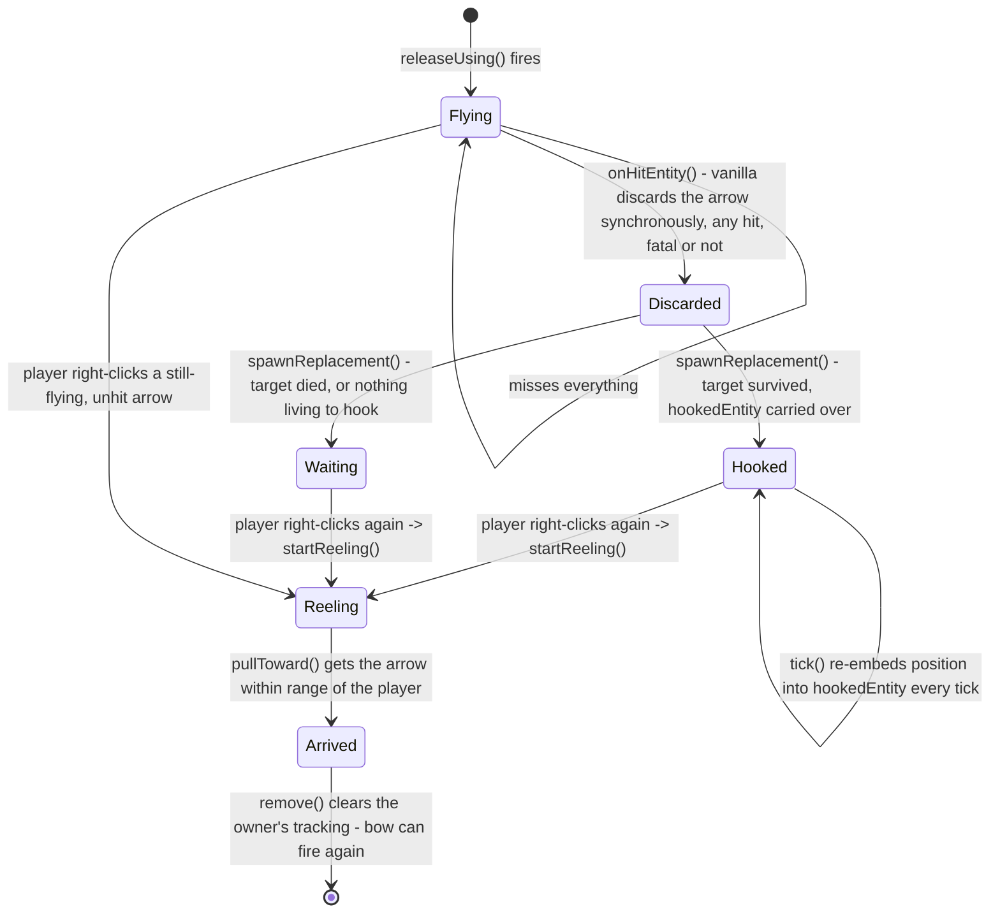
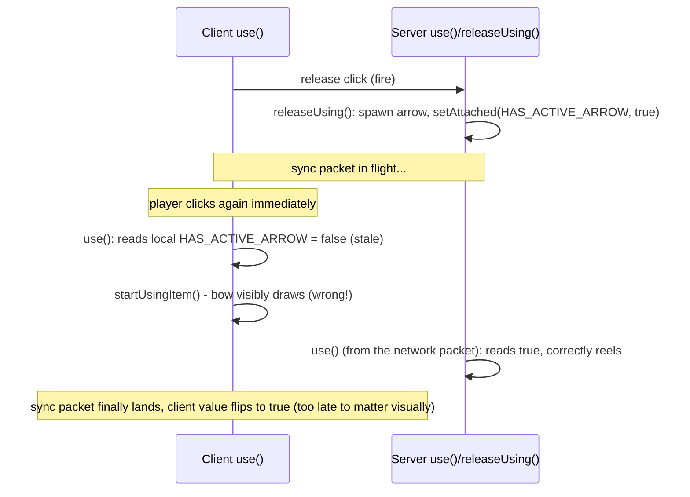
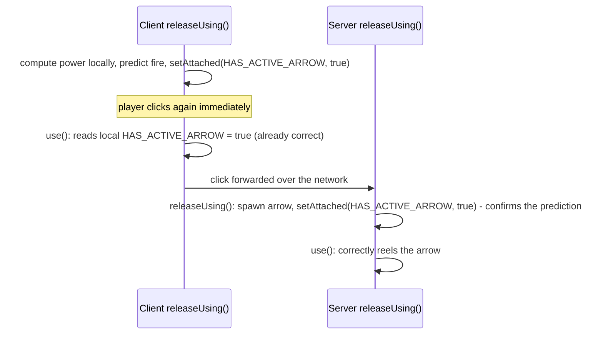
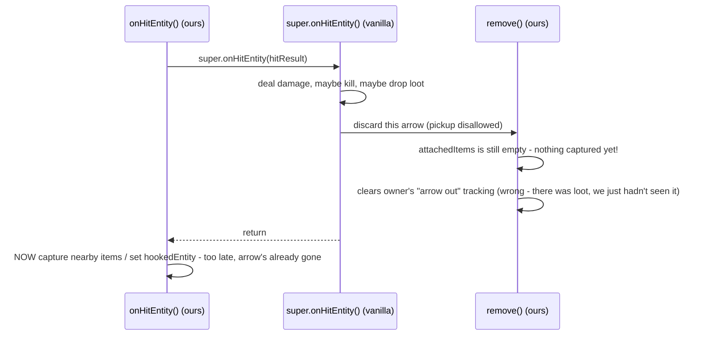
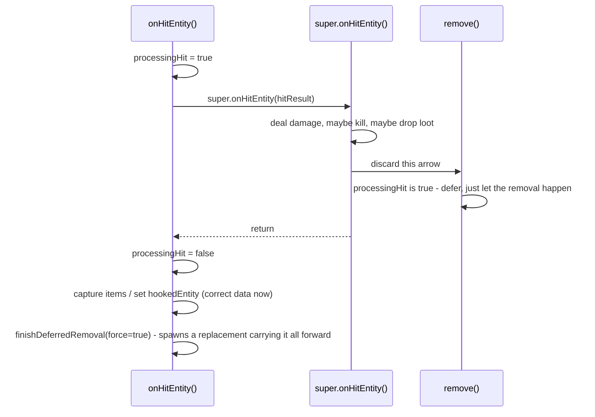
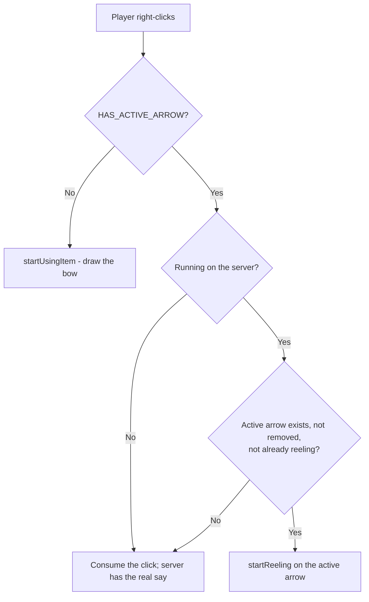
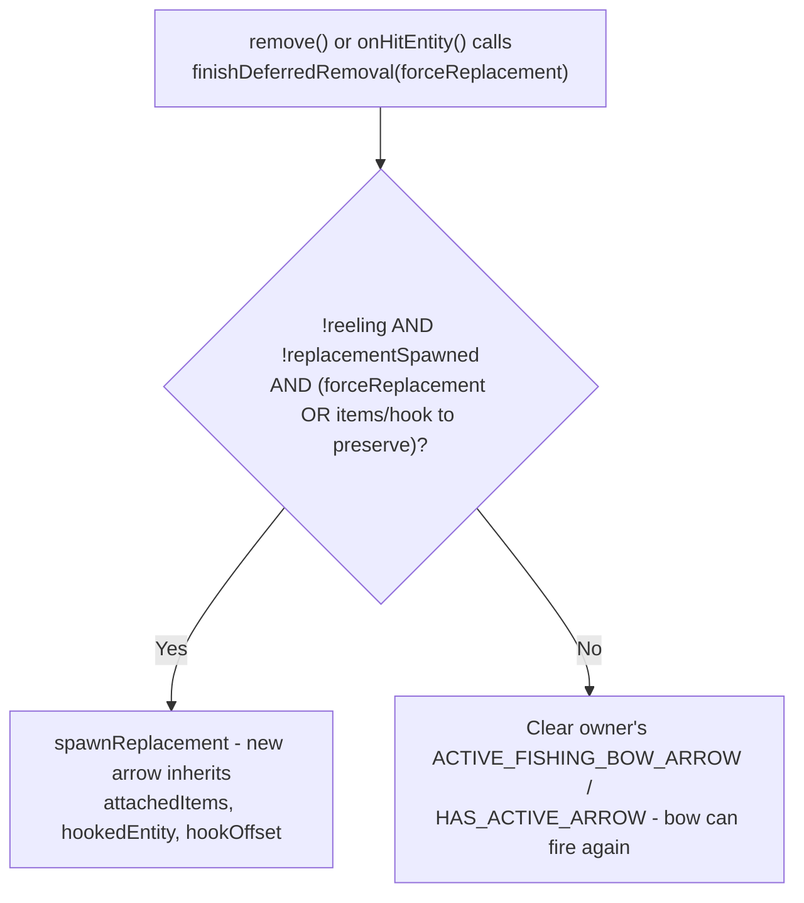

# The Reeling Mechanic: A Case Study

This documents how the Fishing Bow's fire/hook/reel loop actually works, and — more interestingly — the three
non-obvious bugs that showed up building it and why each one happened. None of these are exotic: they're the kind of
client/server and single-method-reentrancy traps that show up in a lot of Minecraft modding, just compressed into one
small feature. That's the main reason this doc exists — as a worked example, not just a reference.

See the main [README](../README.md) for what the item does, and [`balancing.md`](balancing.md) for the damage/
durability numbers. This is about the *mechanism*, not the tuning.

## Components

| Class | Role |
|---|---|
| `FishingBowItem` | Extends `BowItem`. Decides, per right-click, whether to draw the bow or reel in the active arrow. |
| `FishingBowArrow` | Extends `AbstractArrow`. Owns the hit/hook/reel state machine described below. |
| `ModAttachments` | Two [Fabric attachments](https://docs.fabricmc.net/develop/entities/attachments) on the player: `ACTIVE_FISHING_BOW_ARROW` (server-only reference to the live arrow) and `HAS_ACTIVE_ARROW` (a synced `boolean` mirror of "is that reference non-null", readable client-side). |
| `FishingBowArrowRenderer` | Client-only. Renders the arrow plus a line back to the owner's hand. |

Two attachments exist for one value because the client can't see server-only object references at all, but it *does*
need to know "is an arrow currently out" to decide whether right-click should draw or reel — see
[Problem 1](#problem-1-the-client-thought-no-arrow-was-out) below.

## The arrow's lifecycle

Every hit — fatal or not — turns out to destroy the arrow that made it (see
[Problem 2](#problem-2-losing-the-hookthe-loot-on-every-single-hit) for why), so "the arrow you're reeling in" is
almost never the one that was actually fired. A fresh **replacement** takes its place immediately, carrying forward
whatever the original had already captured.

`FishingBowArrow` is registered `.noSave()` ([`ModEntities.java`](../src/main/java/com/evoker/fishingbow/ModEntities.java)),
so none of this state — arrow, hook, or captured items — survives a chunk unload or server restart. That's a
deliberate scope cut, not an oversight: see [Known limitations](#known-limitations).

## Problem 1: the client thought no arrow was out

**Symptom:** after firing, right-clicking again to reel would sometimes visibly draw the bow back instead — even
though the server correctly reeled the arrow a moment later.

**Cause:** `use()` runs independently on the client (to predict the draw pose immediately) and on the server (the
authoritative decision). The client's only way to know "an arrow is already out" was `HAS_ACTIVE_ARROW`, a value the
*server* sets and then has to sync back down. If the player clicked to reel fast enough — often just fast enough to
fire-then-immediately-reel — the client processed that second click before the sync packet for the first click's
`true` had actually arrived.

**Fix:** stop depending on the round trip at all. `releaseUsing()`'s fire/no-fire decision is a pure function of
`ticksHeld`/`power`, computed identically on both sides — so the client can set its own `HAS_ACTIVE_ARROW = true` the
instant *it* releases, with zero network latency, instead of waiting to be told. The server's real sync packet still
arrives afterward and just confirms the same value, so there's no correction/flicker either way.

This is client-side prediction in miniature: predict locally from information you already have, let the
authoritative side reconcile (silently, when it agrees) rather than blocking the visual on a round trip.

## Problem 2: losing the hook/the loot on every single hit

**Symptom:** killing a mob that dropped nothing left no arrow to reel in. Hitting (not killing) a mob that should
have been hooked also left nothing to reel in — the hook was set, then just as immediately gone.

**Cause:** `onHitEntity()` captures whatever a hit just dropped or hooked *after* calling `super.onHitEntity()` (has
to — the loot doesn't exist until vanilla creates it). But `super.onHitEntity()` turned out to synchronously discard
this arrow itself — via our own `remove()` override, called from *inside* that call — on every hit, not just a
killing one (almost certainly because `pickup = Pickup.DISALLOWED` gives vanilla no reason to leave an unpickupable
arrow stuck in the world). `remove()` had no way to know a hit was still in progress, so it always saw an empty
`attachedItems`/`hookedEntity` and correctly (by its own local view) decided there was nothing worth preserving.

**Fix:** a reentrancy flag. `onHitEntity()` sets `processingHit = true` around its call to `super`; `remove()` checks
it and, if true, just lets the discard happen without making the spawn-vs-clear call — deferring that decision back
to `onHitEntity()`, which finishes it (via `finishDeferredRemoval()`) once `attachedItems`/`hookedEntity` actually
reflect what the hit produced. The replacement now *always* spawns on any hit-triggered discard, drops or not,
hooked or not — this bow is meant to never cost the player their one arrow just for landing a good hit.

The general lesson: overriding a method that might call back into *your own* other overrides mid-execution means you
can't assume your override's precondition state is stable across the `super` call — you have to explicitly detect
and handle the reentrant case.

## Problem 3: a hooked mob just... wandered off

**Symptom:** hooking a mob without killing it worked functionally (it registered as hooked, and reeling pulled it
in) — but visually the arrow just sat frozen at the point of impact while the mob walked away from it.

**Cause:** vanilla doesn't actually keep a stuck arrow riding along with whatever it hit. The "arrow sticking out of
a moving mob" you see in normal survival is a cosmetic render trick tied to the mob's own model, not a real entity
tracking its position — so once our arrow *is* a real, persistent entity (per Problem 2's fix), nothing was moving it
to match.

**Fix:** every tick that an arrow has a live `hookedEntity` and isn't yet reeling, re-snap its position to
`hookedEntity.position() + hookOffset` — `hookOffset` being the relative offset at the moment of the hit, captured
once and carried through `spawnReplacement()` like everything else. `setNoPhysics(true)`/`setInGround(false)` keep
vanilla's own stuck-in-ground handling from fighting the repositioning, the same trick already used for the reel-in
flight itself.

This is a deliberate simplification, not a full solution — see [Known limitations](#known-limitations) for the
alternative that was considered and set aside.

## Decision logic reference

How a right-click is routed:

How an arrow's removal is resolved (`finishDeferredRemoval`):

`onHitEntity()` always calls this with `forceReplacement = true` (see Problem 2). `remove()`'s own direct call (for
non-hit removals — successful reel arrival, despawn, chunk unload) passes `false`, since there's no reason to
manufacture an arrow out of thin air there.

## Debug logging

This feature is hard to verify without playtesting (client/server split, timing-sensitive reeling), so it uses a
persistent `[FBDEBUG]`-prefixed logging convention instead of one-off prints added and stripped per bug. See the
project [`CLAUDE.md`](../CLAUDE.md) for the convention itself; grep `run/logs/latest.log` for `[FBDEBUG]` to see it
in action. Every sequence diagram above was reconstructed from exactly this kind of log output, not from reading the
source in isolation — several of these bugs looked entirely different from what the logs actually showed once tested.

## Known limitations

- **Nothing here survives a save.** `FishingBowArrow` is `.noSave()`, and the hook/loot fields aren't written to NBT
  at all. A chunk unload or server restart mid-hook just erases the state — acceptable for a short hook-then-reel
  loop, but worth knowing if this mechanic were ever extended to something longer-lived.
- **Embedding is positional, not pose-aware.** `hookedEntity.position() + hookOffset` tracks a mob's origin, not its
  actual animated pose (limb swing, sneak height, riding a vehicle) — the arrow won't look "seated" in the model the
  way vanilla's own cosmetic stuck-arrows do.
- **An alternative design was considered and set aside**: instead of a real entity following the target, store
  impact metadata (target reference, hit items, etc.) server-side and render a purely cosmetic arrow client-side,
  ideally piggybacking on vanilla's own pose-aware stuck-arrow rendering. That would remove the small residual
  physics/collision surface a live-tracking entity carries (see the questions below), at the cost of splitting
  gameplay state and its visual representation into two things that have to be kept in sync, plus needing a new sync
  payload and engine-internals rendering work this project's tooling (IDE-index only, no bytecode tracing) can't
  verify ahead of time. Revisit if the live-tracking approach ever proves insufficient in practice.
- **Unverified**: whether `Pickup.DISALLOWED` fully blocks another player from doing anything by walking into a
  hooked/waiting arrow, and how a hooked arrow behaves near an explosion or fire, haven't been explicitly tested yet.
